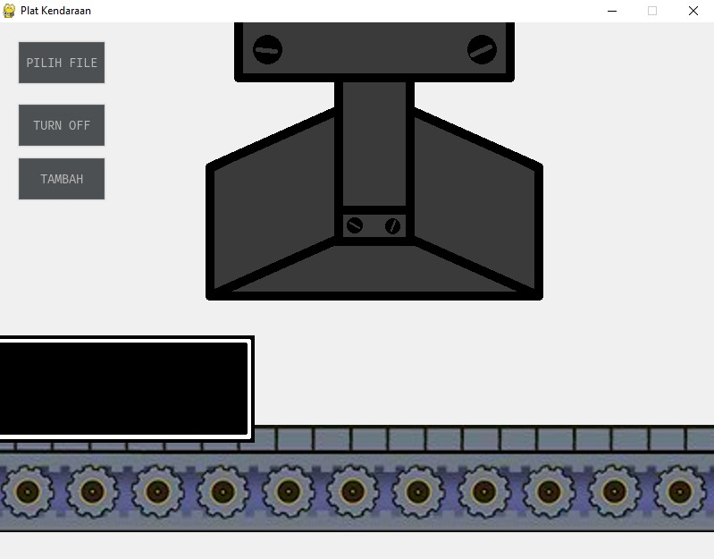
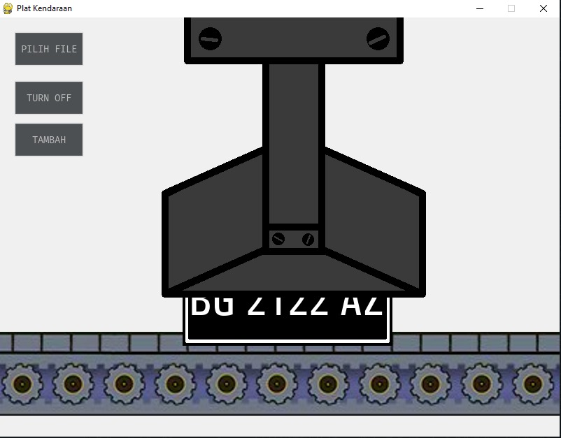
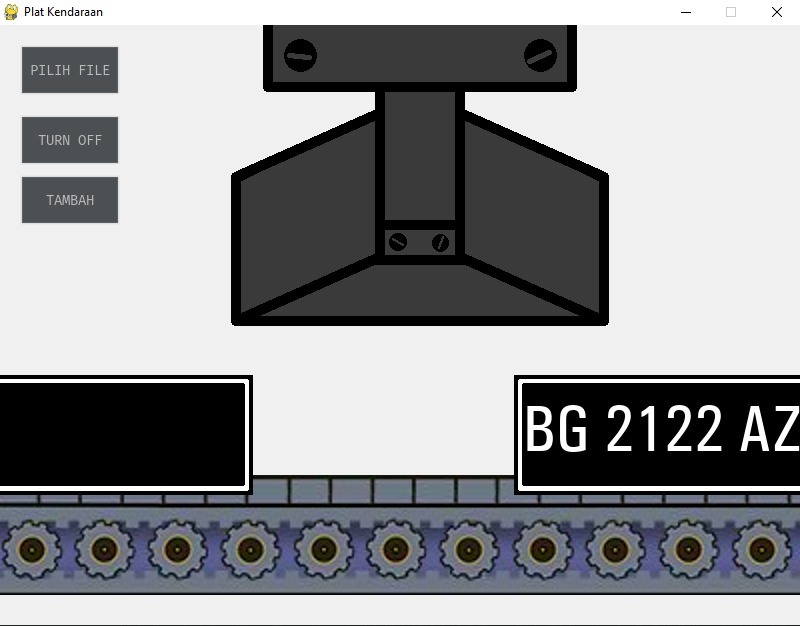

# PlatKendaraan
Animasi dinamis mencetak plat kendaraan. Dibuat untuk menyelesaikan kuliah Antarmuka dan Periferal

Sprite belt didownload dari https://obsoletegame.wordpress.com/2013/10/01/conveyor-belt-sprite/  
Sisanya buat sendiri menggunakan LibreSprite
